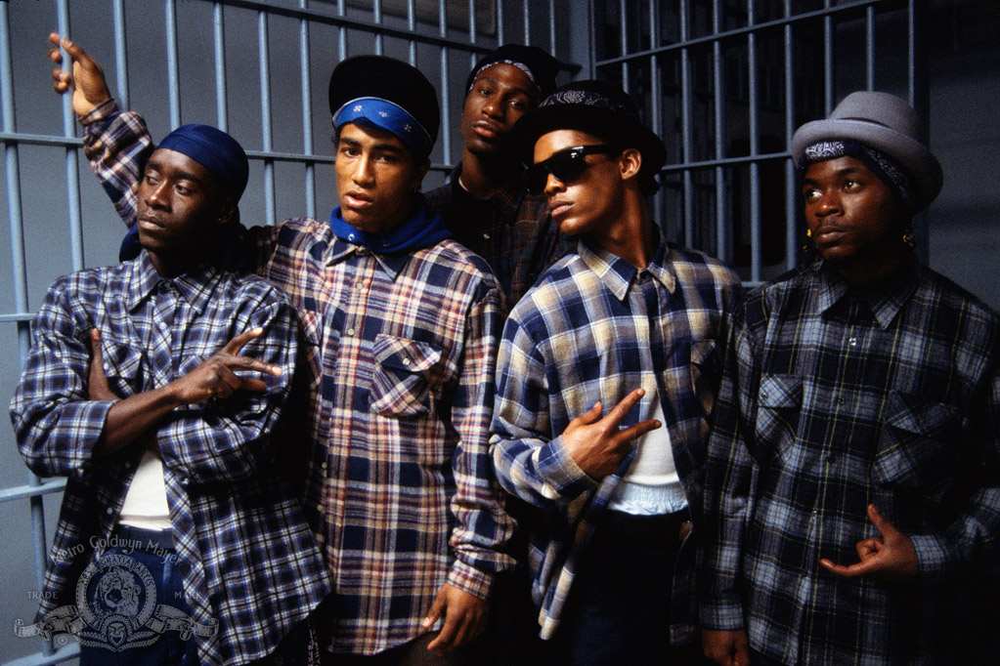

# Colors plugin for Craft CMS

Craft access to [phpColors](https://github.com/mexitek/phpColors) library and methods

## Installation

To install Colors, follow these steps:

1. Download & unzip the file and place the `colors` directory into your `craft/plugins` directory
2.  -OR- do a `git clone https://github.com/@cole007/colors.git` directly into your `craft/plugins` folder.  You can then update it with `git pull`
3. Install plugin in the Craft Control Panel under Settings > Plugins
4. The plugin folder should be named `colors` for Craft to see it.  GitHub recently started appending `-master` (the branch name) to the name of the folder for zip file downloads.

Colors works on Craft 2.4.x and Craft 2.5.x.

## Colors Overview

-Insert text here-

## Configuring Colors

-Insert text here-

## Using Colors

-Insert text here-

## Colors Roadmap

Some things to do, and ideas for potential features:

* Release it

## Colors Changelog

### 0.0.1 -- 2016.05.24

* Initial release

## Credits

- Conor icon/logo by Oleg Naumov 
https://thenounproject.com/search/?q=colors&i=149225
- Colours photo still taken from 1988 film direct by Dennis Hopper http://www.pocho.com/everything-you-wanted-to-know-about-colors-but-were-afraid-to-ask/

Brought to you by [@cole007](http://ournameismud.co.uk/)